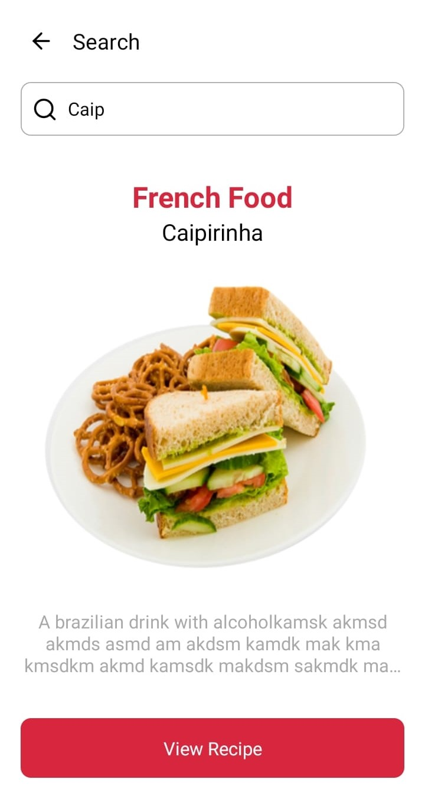

# **Recipe**

App para usuários que querem aprender algo novo, cozinhar algo novo, aqui eles podem conhecer e aprender a fazer receitas postadas por outros usuários, e caso você tenha uma boa receita, também pode postar para ajudar novas pessoas. Conectado à uma API em Node. 

-- --

## **Screenshots**

-- --

## **Features**

- Cadastro e Login
- Adicionar, filtrar,  ver detalhes e pesquisar por receitas
- Editar Perfil
- Salvar receita como favorita
- Adicionar ingredientes no seu refrigerador para poder organizar e também filtrar, para mostrar receitas que tem com seus ingredientes salvos

-- --

## **Getting Started**

### Abra o Prompt de Comando

    git clone https://github.com/MatheusGomesRocha/recipe_RN

    cd recipe_RN && npm install`

### Abra um novo Prompt de Comando

    cd path/recipe_RN && react-native run-android 
    cd path/recipe_RN && react-native run-ios 
    
-- --

## **Tecnologia usada**

- React-native

-- --
## Meta

- Matheus Gomes
- Email - matheusgomes192@hotmail.com
- Linkedin - https://www.linkedin.com/in/matheus-gomes-2a61a8190/ 
